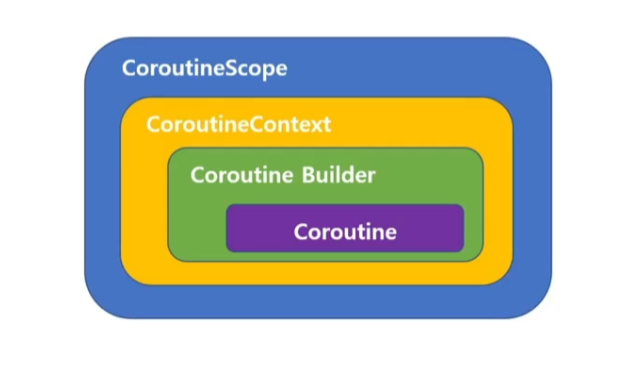
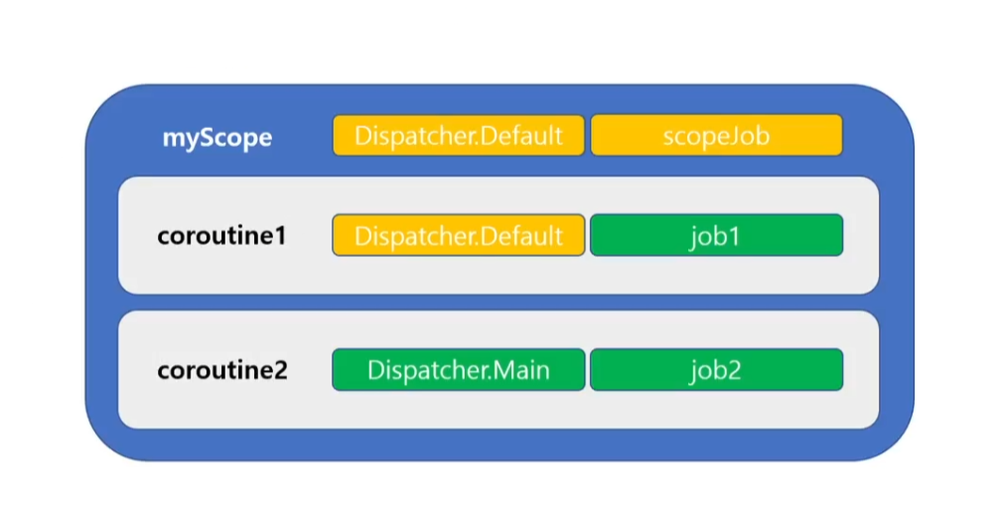

### CoroutineScope

코루틴이 실행되는 영역
스코프를 선언하고 그 스코프에 CoroutineContext를 지정
스코프에서 CoroutineContext 이용하여 코루틴이 만들어지고 실행

코루틴 빌더(launch, async 등)와 스코핑 함수(scoping function - coroutineScope , withContext)는
모두 스코프가 지정되어야 하며 그 스코프 에서 실행된다

스코프는 Coroutine 인터페이스를 구현한 클래스의 객체

스코프는 코루틴을 구조화하기 위한 목적
스코프 그자체가 job 이됨
스코프 내에서 여러 코루틴을 실행시킴으로써
스코프에 동일한 설정이 적용되게 할수있으며 한꺼번에 제어 가능

### CoroutineContext

CoroutineContext 는 코루틴을 위한 설정 정보
CoroutineContext 는 스코프에 선언하여 해당 스코프에 실행되는 코루틴을 위한 공통의 설정
개별 코루틴에서 변경 혹은 추가 가능

Job: 코루틴 생명주기 제어
CoroutineDispatcher: 코루틴이 실행될 스레드 지정
CoroutineName: 코루틴 이름
CoroutineExceptionHandler: 예외처리

여러가지 설정을 하고자 한다면 + 연산자을 이용

